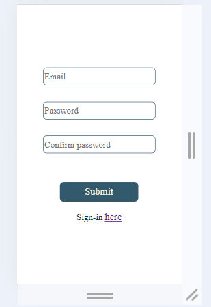
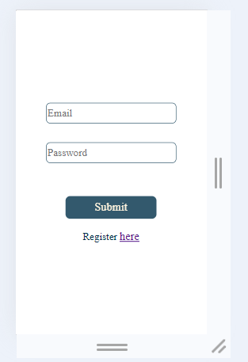
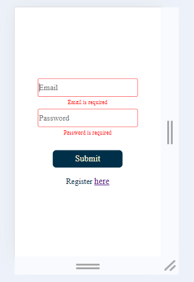
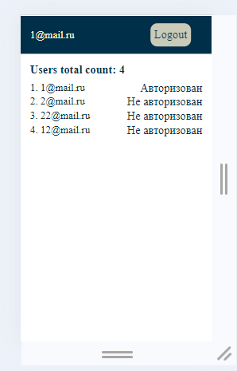

Registration form
=====================

В приложении реализована форма регистрации и аутентификации пользователей. После того, как пользователь зарегистрировался, осуществляется переход на главную страницу, на которой отображены все зарегистрированные пользователи.

Содержание
-----------------------------------
* <a name="#технологии">Технологии</a>
* <a name="#начало_работы">Начало работы</a>
* <a name="#скриншоты">Скриншоты</a>

Технологии
-----------------------------------
Клиентская часть написана на React JS. Для управления состоянием полей ввода использовалась библиотека React Hook Form. В качестве менеджера состояния использовался Redux.
Серверная часть написана на Express JS.
Взаимодействие клиентской и серверной частей реализовано с помощью библиотеки axios.

Начало работы
-----------------------------------

cd server --> node server

cd client --> npm start

Скриншоты
-----------------------------------

